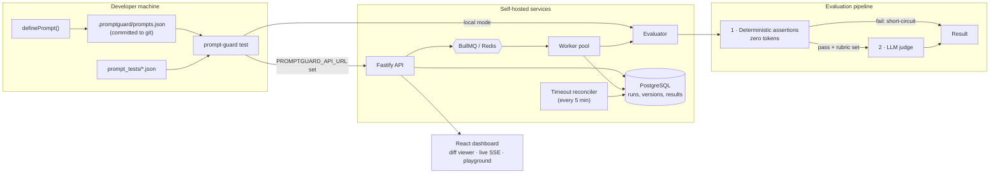

# PromptGuard

**Self-hostable regression testing for LLM prompts.** Change a prompt, and PromptGuard tells you whether it still behaves — using cheap deterministic checks first, and an LLM judge only when it has to.

It runs two ways: as a single-process CLI in your CI pipeline, or as a distributed service (API + queue + workers + dashboard) that persists every run, versions every prompt by content hash, and shows you the diff that caused a regression.

---

## Why this exists

Prompts are code that you cannot diff meaningfully. Change `"Be concise"` to `"Be concise and empathetic"` and every downstream output changes — but a string comparison tells you nothing about whether the change was an improvement or a regression.

The usual answers are both bad:

- **Exact-match assertions** break on every harmless rewording, so teams delete them.
- **Judging everything with an LLM** is slow and costs money on every commit, so teams run it rarely, which defeats the point.

PromptGuard splits the problem. Deterministic assertions (`contains`, `regex`, JSON Schema, latency budgets) run locally at zero cost and catch the majority of real breakages — malformed JSON, leaked apology preambles, missing citations, blown latency budgets. Only cases that pass those checks and carry a rubric reach the LLM judge. A failing deterministic assertion **short-circuits before any model call is made**.

The practical result: you can run the full suite on every commit for free, and spend tokens only where semantic judgement is genuinely required.

### Where this sits in the ecosystem

This is not a promptfoo replacement. [Promptfoo](https://promptfoo.dev) is the mature, widely adopted CLI in this space, and if you want a battle-tested local eval runner you should use it.

PromptGuard's distinct piece is the **distributed execution layer** — the part a single-process CLI structurally cannot offer:

| | Single-process eval CLIs | PromptGuard |
|---|---|---|
| Local runs | Yes | Yes |
| Durable run history | Files on disk | PostgreSQL |
| Concurrent/queued execution | No | BullMQ + Redis, horizontally scalable workers |
| Crash recovery | Re-run by hand | Stalled-job handlers + timeout reconciler |
| Prompt versioning | Manual | SHA-256 content-hashed, auto-versioned |
| Baseline comparison | Manual | Reads the prior registry from git history |
| Vendor coupling | Varies | None — self-hosted, six providers, no SaaS |

It is fully self-hostable with no external services: `docker compose up` gives you the entire stack.

---

## Quick start

### Full stack with seeded demo data (no API keys)

```bash
docker compose up -d
docker compose exec api-server pnpm seed
```

- Dashboard: <http://localhost:3000>
- API: <http://localhost:4000>
- Health: `curl http://localhost:4000/health` → `{"status":"ok","db":"connected","redis":"connected"}`

The seed writes four realistic prompts with version history and ~28 historical runs. No LLM is called and no key is required.

### CLI only

```bash
npx prompt-guard init      # scaffolds config, sample tests, empty registry
npx prompt-guard test      # runs the suite
```

`init` defaults to the offline mock provider, so the scaffolded project runs immediately with no key. Pick a real provider with `--provider groq` (or `anthropic`, `gemini`, `openai`, `ollama`).

---

## Architecture



**Run lifecycle.** `POST /runs` persists the run and enqueues one job per prompt. A worker marks the run `RUNNING`, stamps a 15-minute `timeoutAt`, and hands off to the judge queue. Each finished prompt increments a counter; when it reaches `expectedJobs` the run finalises. Three mechanisms stop a run hanging forever: BullMQ `failed` handlers, `stalled` handlers for workers that died holding a lock, and a periodic reconciler that fails any run past its deadline.

---

## Test case format

A case needs `assert`, `expect`, or both.

```json
{
  "cases": [
    {
      "input": "Return a JSON object with keys \"status\" and \"code\".",
      "assert": {
        "json_schema": {
          "type": "object",
          "required": ["status", "code"],
          "properties": {
            "status": { "type": "string" },
            "code": { "type": "number" }
          }
        },
        "not_contains": "I'm sorry",
        "max_latency_ms": 10000
      }
    },
    {
      "input": "A customer is angry their order arrived damaged. Reply to them.",
      "expect": "Apologises, acknowledges the damage, and offers a refund or replacement without blaming the customer."
    }
  ]
}
```

### Deterministic checks — free, local, no model call

| Check | Type | Passes when |
|---|---|---|
| `contains` | `string \| string[]` | Every listed substring is present |
| `not_contains` | `string \| string[]` | No listed substring is present |
| `regex` | `string` | The pattern matches the output |
| `json_schema` | JSON Schema object | Output parses as JSON and validates |
| `max_latency_ms` | `number` | Generation finished within budget |

All present checks must pass. Unknown keys are rejected, so a typo fails loudly rather than passing silently.

### Semantic check — `expect`

A plain-English rubric handed to the judge model, which returns `{pass, reason, drift}`. Only reached when every deterministic check passed.

---

## Providers

| Provider | `provider` | Default model | Key | Notes |
|---|---|---|---|---|
| Mock | `mock` | — | none | Deterministic, offline. **Default.** |
| Ollama | `local` | `llama3` | none | Local daemon |
| OpenAI | `openai` | — | `OPENAI_API_KEY` | JSON mode |
| Anthropic | `anthropic` | `claude-3-5-haiku-latest` | `ANTHROPIC_API_KEY` | |
| Google | `gemini` | `gemini-1.5-flash` | `GEMINI_API_KEY` | Free tier; native JSON mode |
| Groq | `groq` | `llama3-8b-8192` | `GROQ_API_KEY` | Free tier; very fast |

Every provider retries 429/5xx with exponential backoff and jitter (3 attempts), uses structured JSON output where supported with regex extraction as fallback, and reports `estimatedCostUsd` from published per-token pricing.

Configure in `promptguard.config.ts`:

```ts
export default {
  threshold: 0.1,        // max share of failing cases before a prompt is "regressed"
  testsDir: "prompt_tests",
  concurrency: 5,        // bounded parallelism; prevents 429 storms
  generationModel: { provider: "mock", model: "mock" },
  judgeModel: { provider: "mock", model: "mock" }
};
```

---

## GitHub Actions

```yaml
name: Prompt regression

on: [pull_request]

jobs:
  promptguard:
    runs-on: ubuntu-latest
    steps:
      - uses: actions/checkout@v4
        with:
          fetch-depth: 0   # baselines are read from git history

      - uses: actions/setup-node@v4
        with:
          node-version: "22"

      # No API key: deterministic assertions and MockProvider only, zero cost.
      - run: npx prompt-guard test --base "origin/${{ github.base_ref }}"
```

`prompt-guard test` exits non-zero when any prompt's drift exceeds `threshold`, so it gates a PR like any other check.

> **`.promptguard/prompts.json` must be committed.** `--base <ref>` resolves the baseline with `git show <ref>:.promptguard/prompts.json`. If the registry is gitignored, every baseline comparison silently resolves to empty and compares against nothing.

---

## API

| Method | Path | Purpose |
|---|---|---|
| `GET` | `/health` | DB + Redis connectivity; 503 when degraded |
| `POST` | `/runs` | Create a run and enqueue jobs |
| `GET` | `/runs` | List runs; `?status=`, `?environment=`, `?limit=`, `?cursor=` |
| `GET` | `/runs/:id` | Run summary |
| `GET` | `/runs/:id/results` | Per-case results |
| `GET` | `/runs/:id/view` | Run + results + prompt diffs |
| `GET` | `/runs/:id/events` | SSE stream of live progress |
| `DELETE` | `/runs/:id` | Delete a run, cascading its results |
| `GET` | `/prompts` | Registered prompts |
| `GET` | `/prompts/:id` | Prompt with full version history |
| `GET` | `/prompts/:id/runs` | Runs touching a prompt |
| `POST` | `/evaluate` | Single-case evaluation (Playground) |

---

## Repository layout

```
apps/
  api-server/      Fastify + Prisma (PostgreSQL) + BullMQ
  worker/          Queue consumers, run finalisation, timeout reconciler
  web-dashboard/   React + Vite + Tailwind + Monaco diff viewer
packages/
  shared-types/    Zod + TypeScript contracts (single source of truth)
  llm-provider/    Six providers, retry, pricing, provider factory
  evaluator/       Two-stage pipeline, bounded concurrency
  sdk/             definePrompt + content-hashed registry
  cli/             prompt-guard init / test
```

## Development

```bash
corepack pnpm install
corepack pnpm -r build
corepack pnpm -r test           # 265 tests
corepack pnpm -r test:coverage  # thresholds enforced per package
```

See [CONTRIBUTING.md](CONTRIBUTING.md).

## License

MIT
