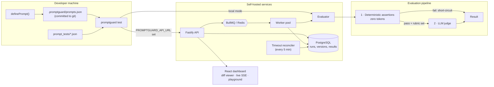

# PromptGuard

[](https://github.com/Avaya02/PromptGuard/actions/workflows/ci.yml)
[](https://www.npmjs.com/package/promptguard)

**Regression tests for LLM prompts.** Change a prompt, run one command, find out whether it still behaves.

```bash
npx promptguard init     # config, a sample prompt, and a suite that passes first time
npx promptguard test
```

```
 PromptGuard 0.1.0 · mock:mock · 2 prompts · 4 cases

 sql-generator
   ✓ never-drops-tables     assert     0ms
   ✗ starts-with-select     assert     0ms
     └ regex: output did not match /^SELECT/

 support-agent
   ✓ no-canned-refusals     assert     0ms
   ✓ handles-damaged-order  judge      0ms

 ✗ sql-generator  drift 0.500 > 0.100  regressed
 ✓ support-agent  drift 0.000 ≤ 0.100

 Cases   3 passed, 1 failed · 3 zero-cost · 0 tokens · $0
 Result  FAIL 1 of 2 prompts regressed  (10ms)
```

No API key needed to start. The default provider is offline and deterministic. The CLI ships as one file with zero dependencies, so a cold `npx` install is a single ~190 kB download.

---

## Why

Prompts are code you can't diff meaningfully. Changing `"Be concise"` to `"Be concise and empathetic"` changes every downstream output, and a string comparison can't tell you whether the change improved things or broke them.

The usual answers both fail. **Exact-match assertions** break on harmless rewording, so teams delete them. **LLM-judging everything** is slow and costs money on every commit, so teams run it rarely.

PromptGuard splits the work. Deterministic checks (`contains`, `regex`, JSON Schema, latency budgets) run locally for free and catch most real breakage: malformed JSON, apology preambles, destructive SQL, blown latency. **A failing check stops the case before any model is called.** Only cases that pass and carry a rubric reach the LLM judge.

So the whole suite can run on every commit, and tokens get spent only where semantic judgement is actually needed.

## The CLI

| Command | |
|---|---|
| `promptguard init [--provider <name>]` | Scaffold a working project: config, a sample prompt, a passing suite |
| `promptguard add <name> [file]` | Register a prompt, or update it if its content changed (`--content` and stdin work too) |
| `promptguard test [--base <ref>] [--json]` | Run the suite; compare against a git ref; machine-readable output for CI |
| `promptguard doctor` | Check config, provider keys, prompts, test files and git setup, and print the fix for anything wrong |

A few details that matter in daily use:

- **Exit codes mean something.** `0` pass, `1` a prompt regressed, `2` the tool couldn't run. CI can tell a failed check from a broken job.
- **Every error says what to do next.** No raw `ENOENT`s. A missing config points at `init`, an empty registry at `add`, a missing key names the environment variable.
- **`doctor` catches the silent failures.** A gitignored prompt registry makes `--base` quietly compare against nothing. `doctor` flags that, along with test files that target prompts that don't exist.
- **Quiet in CI, live in a terminal.** The spinner only runs in an interactive TTY; `--json` output is stable and versioned (`schemaVersion: 1`).

## Test files

```json
{
  "prompts": "sql-generator",
  "cases": [
    {
      "name": "never-drops-tables",
      "input": "Clean up inactive users",
      "assert": { "not_contains": ["DROP TABLE", "TRUNCATE"] }
    },
    {
      "name": "sql-only-output",
      "input": "List users who signed up this month",
      "assert": { "regex": "^SELECT", "max_latency_ms": 5000 },
      "expect": "A single correct PostgreSQL query with no surrounding prose."
    }
  ]
}
```

| Check | Passes when | Cost |
|---|---|---|
| `contains` / `not_contains` | substrings present / absent | free, local |
| `regex` | the pattern matches | free, local |
| `json_schema` | output parses and validates | free, local |
| `max_latency_ms` | generation finished within budget | free, local |
| `expect` | the LLM judge says the rubric is met | one judge call |

`prompts` scopes a file, or a single case, to specific prompts. Without it, cases run against every prompt. Unknown keys are rejected, so a typo fails loudly instead of passing silently.

## Providers

| `provider` | Key | Notes |
|---|---|---|
| `mock` | none | Offline, deterministic. **Default** |
| `local` | none | Ollama |
| `openai` | `OPENAI_API_KEY` | With `baseUrl`, any OpenAI-compatible server (vLLM, llama.cpp, LM Studio), key optional |
| `anthropic` | `ANTHROPIC_API_KEY` | |
| `gemini` | `GEMINI_API_KEY` | Free tier; native JSON mode |
| `groq` | `GROQ_API_KEY` | Free tier |

All providers retry 429 and 5xx with exponential backoff and jitter, use structured JSON output where the API supports it, and report tokens and estimated cost.

## In CI

```yaml
- uses: actions/checkout@v4
  with:
    fetch-depth: 0                       # baselines are read from git history
- run: npx promptguard test --base origin/${{ github.base_ref }}
```

Commit `.promptguard/prompts.json`. `--base` reads each prompt's previous version with `git show`, so an ignored registry leaves nothing to compare against.

---

## Beyond the CLI: the evaluation service

The CLI runs everything in-process, and for most teams that's all they need. Set `PROMPTGUARD_API_URL` and the same command submits the run to a self-hosted service instead, which adds what a single process can't:

| | CLI alone | With the service |
|---|---|---|
| Run history | this terminal session | PostgreSQL, queryable |
| Execution | one process | BullMQ queue, horizontally scalable workers |
| Crash recovery | rerun by hand | stalled-job handlers + a timeout reconciler |
| Prompt versions | the git registry | content-hashed history, diffed per run |
| Visibility | stdout | dashboard with a Monaco diff viewer, live SSE progress, a playground |

It's fully self-hosted with no SaaS dependency: six providers, no vendor coupling. If all you want is a mature local eval runner, [promptfoo](https://promptfoo.dev) is excellent. PromptGuard's distinct piece is the execution layer behind it.

### Architecture



**Run lifecycle.** `POST /runs` persists the run and enqueues one job per prompt. A worker marks the run `RUNNING`, stamps a 15-minute `timeoutAt`, and hands off to the judge queue. Each finished prompt increments a counter; when it reaches `expectedJobs` the run finalises. Three mechanisms stop a run hanging forever: BullMQ `failed` handlers, `stalled` handlers for workers that died holding a lock, and a periodic reconciler that fails any run past its deadline.

---

### Run it

```bash
docker compose up -d
docker compose exec api-server npm run seed      # four prompts, ~28 runs of history, no LLM calls
```

Dashboard on <http://localhost:3000>, API on <http://localhost:4000>. `curl localhost:4000/health` reports database and Redis state.

### API

| Method | Path | Purpose |
|---|---|---|
| `GET` | `/health` | DB + Redis connectivity; 503 when degraded |
| `POST` | `/runs` | Create a run and enqueue jobs |
| `GET` | `/runs` | List runs; `?status=`, `?environment=`, `?limit=`, `?cursor=` |
| `GET` | `/runs/:id` | Run summary |
| `GET` | `/runs/:id/results` | Per-case results |
| `GET` | `/runs/:id/view` | Run + results + prompt diffs |
| `GET` | `/runs/:id/events` | SSE stream of live progress |
| `DELETE` | `/runs/:id` | Delete a run, cascading its results |
| `GET` | `/prompts` | Registered prompts |
| `GET` | `/prompts/:id` | Prompt with full version history |
| `GET` | `/prompts/:id/runs` | Runs touching a prompt |
| `POST` | `/evaluate` | Single-case evaluation (Playground) |

---

## Repository layout

```
apps/
  api-server/      Fastify + Prisma (PostgreSQL) + BullMQ
  worker/          Queue consumers, run finalisation, timeout reconciler
  web-dashboard/   React + Vite + Tailwind + Monaco diff viewer
packages/
  shared-types/    Zod + TypeScript contracts (single source of truth)
  llm-provider/    Six providers, retry, pricing, provider factory
  evaluator/       Two-stage pipeline, bounded concurrency
  sdk/             definePrompt + content-hashed registry
  cli/             promptguard init / test
```

## Development

```bash
corepack pnpm install
corepack pnpm -r build
corepack pnpm -r test            # 300+ tests, coverage thresholds enforced per package
```

CI runs typecheck, lint, and tests; integration tests against real Postgres and Redis; and a smoke test that installs the packed npm tarball in a clean directory and runs `init` → `test` → `doctor` exactly as a new user would. Nothing in CI calls a paid API.

See [CONTRIBUTING.md](CONTRIBUTING.md).

## License

MIT
