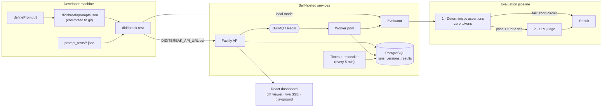

# Self-hosted service

> Today the service runs the [prompt regression suite](prompt-testing.md). Agent context experiments (`compare`, `ablate`) run locally; moving their trials onto the queue and workers is the next step for the service.

The CLI runs everything in-process, and for most teams that's all they need. Set `DIDITBREAK_API_URL` and the same command submits the run to a self-hosted service instead, which adds what a single process can't:

| | CLI alone | With the service |
|---|---|---|
| Run history | this terminal session | PostgreSQL, queryable |
| Execution | one process | BullMQ queue, horizontally scalable workers |
| Crash recovery | rerun by hand | stalled-job handlers + a timeout reconciler |
| Prompt versions | the git registry | content-hashed history, diffed per run |
| Visibility | stdout | dashboard with a Monaco diff viewer, live SSE progress, a playground |

It's fully self-hosted with no SaaS dependency: six providers, no vendor coupling. If all you want is a mature local eval runner, [promptfoo](https://promptfoo.dev) is excellent. diditbreak's distinct piece is the execution layer behind it.

### Architecture



**Run lifecycle.** `POST /runs` persists the run and enqueues one job per prompt. A worker marks the run `RUNNING`, stamps a 15-minute `timeoutAt`, and hands off to the judge queue. Each finished prompt increments a counter; when it reaches `expectedJobs` the run finalises. Three mechanisms stop a run hanging forever: BullMQ `failed` handlers, `stalled` handlers for workers that died holding a lock, and a periodic reconciler that fails any run past its deadline.

---

### Run it

```bash
docker compose up -d
docker compose exec api-server npm run seed      # four prompts, ~28 runs of history, no LLM calls
```

Dashboard on <http://localhost:3000>, API on <http://localhost:4000>. `curl localhost:4000/health` reports database and Redis state.

### API

| Method | Path | Purpose |
|---|---|---|
| `GET` | `/health` | DB + Redis connectivity; 503 when degraded |
| `POST` | `/runs` | Create a run and enqueue jobs |
| `GET` | `/runs` | List runs; `?status=`, `?environment=`, `?limit=`, `?cursor=` |
| `GET` | `/runs/:id` | Run summary |
| `GET` | `/runs/:id/results` | Per-case results |
| `GET` | `/runs/:id/view` | Run + results + prompt diffs |
| `GET` | `/runs/:id/events` | SSE stream of live progress |
| `DELETE` | `/runs/:id` | Delete a run, cascading its results |
| `GET` | `/prompts` | Registered prompts |
| `GET` | `/prompts/:id` | Prompt with full version history |
| `GET` | `/prompts/:id/runs` | Runs touching a prompt |
| `POST` | `/evaluate` | Single-case evaluation (Playground) |

---
