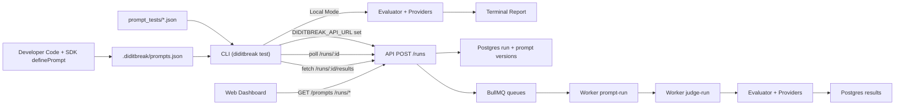

# diditbreak Codebase Walkthrough

This document is a practical operator-level walkthrough of the current codebase in `/Applications/Projects/diditbreak`.

Use it as:
- an architecture map,
- a file-by-file ownership guide,
- a runbook for local/CI execution,
- and an accountability checklist for ongoing maintenance.

---

## 1. What This System Does

diditbreak detects **behavioral regressions** in prompts.

It supports two execution modes:

1. **Standalone Local Mode (CLI-only)**
- CLI loads local prompt registry + test files.
- Generates/judges responses directly via configured providers.
- Prints a report and exits non-zero on regression.

2. **CI/API Mode (distributed)**
- CLI submits run payload to API.
- API persists run metadata and enqueues jobs.
- Worker consumes jobs, evaluates prompts, stores results.
- CLI polls run status and prints remote results.
- Web dashboard reads API data for prompt/run visibility.

---

## 2. Monorepo Layout

Top-level structure:

```text
apps/
  api-server/
  worker/
  web-dashboard/
packages/
  shared-types/
  llm-provider/
  evaluator/
  sdk/
  cli/
```

Workspace and toolchain:
- Workspace config: `/Applications/Projects/diditbreak/pnpm-workspace.yaml`
- Root scripts + shared dev tooling: `/Applications/Projects/diditbreak/package.json`
- Base strict TS config: `/Applications/Projects/diditbreak/tsconfig.json`
- ESLint flat config: `/Applications/Projects/diditbreak/eslint.config.mjs`
- Infra compose: `/Applications/Projects/diditbreak/docker-compose.yml`

---

## 3. End-to-End Architecture



---

## 4. Core Contracts (Single Source of Truth)

All shared contracts live in:
- `/Applications/Projects/diditbreak/packages/shared-types/src/index.ts`

Primary domains defined there:
- Model config (`ModelConfig`)
- Prompt/test/evaluation shapes (`RegisteredPrompt`, `NamedTestCase`, `EvaluationResult`)
- API DTOs (`CreateRunRequest`, `RunSummary`, `RunResultRecord`, `RunViewResponse`)
- Queue payloads (`PromptRunJobPayload`)
- Run enums (`RunEnvironment`, `RunStatus`)
- Queue names (`QUEUE_NAMES`)

Ownership rule:
- If API, worker, CLI, or dashboard payloads drift, update here first and propagate.

---

## 5. Package-by-Package Walkthrough

## 5.1 `@diditbreak/shared-types`

Path:
- `/Applications/Projects/diditbreak/packages/shared-types`

Role:
- Cross-workspace type contract package.
- Avoids duplicating runtime payload types across services.

Key file:
- `/Applications/Projects/diditbreak/packages/shared-types/src/index.ts`

---

## 5.2 `@diditbreak/llm-provider`

Path:
- `/Applications/Projects/diditbreak/packages/llm-provider`

Role:
- Abstracts generation/judge model integrations.

Important files:
- Interface: `/Applications/Projects/diditbreak/packages/llm-provider/src/llm-provider.ts`
- Ollama impl: `/Applications/Projects/diditbreak/packages/llm-provider/src/providers/local-ollama-provider.ts`
- OpenAI impl: `/Applications/Projects/diditbreak/packages/llm-provider/src/providers/openai-provider.ts`
- Mock impl: `/Applications/Projects/diditbreak/packages/llm-provider/src/providers/mock-provider.ts`
- Judge prompt builder: `/Applications/Projects/diditbreak/packages/llm-provider/src/utils/judge-prompt.ts`
- Judge JSON parser: `/Applications/Projects/diditbreak/packages/llm-provider/src/utils/parse-judge-result.ts`

Notes:
- `LocalOllamaProvider` hits `POST /api/generate` on `http://127.0.0.1:11434` by default.
- `OpenAIProvider` requires API key (`OPENAI_API_KEY` by default).
- Parsing is resilient: malformed judge output fails safe to `pass=false`, `drift=1`.

---

## 5.3 `@diditbreak/evaluator`

Path:
- `/Applications/Projects/diditbreak/packages/evaluator`

Role:
- Core orchestration for semantic evaluation per prompt.

Flow:
1. Per test case, generate `responseB` (and `responseA` when baseline exists and rubric not provided).
2. Run judge via provider.
3. Collect per-case result with drift/latency/tokens.
4. Aggregate to prompt-level drift score and pass/fail via threshold.

Important files:
- Public orchestrator: `/Applications/Projects/diditbreak/packages/evaluator/src/run-evaluation.ts`
- Per-case execution: `/Applications/Projects/diditbreak/packages/evaluator/src/runner/evaluate-case.ts`
- Rubric prompt shaping: `/Applications/Projects/diditbreak/packages/evaluator/src/prompts/judge-templates.ts`
- Types: `/Applications/Projects/diditbreak/packages/evaluator/src/types.ts`

Behavioral detail:
- Prompt passes when `failedTests / totalTests <= threshold`.

---

## 5.4 `@diditbreak/sdk`

Path:
- `/Applications/Projects/diditbreak/packages/sdk`

Role:
- Prompt registration and registry IO.

Registry file:
- `.diditbreak/prompts.json`

Important files:
- Registration API: `/Applications/Projects/diditbreak/packages/sdk/src/define-prompt.ts`
- Registry read API: `/Applications/Projects/diditbreak/packages/sdk/src/read-prompt-registry.ts`
- Storage primitives: `/Applications/Projects/diditbreak/packages/sdk/src/registry/storage.ts`
- Hashing: `/Applications/Projects/diditbreak/packages/sdk/src/registry/hash.ts`
- Zod schema: `/Applications/Projects/diditbreak/packages/sdk/src/registry/schema.ts`

Behavior:
- `definePrompt(name, content)` computes SHA-256 hash.
- Same hash for same prompt name returns existing record (no version bump).
- Changed content increments prompt version.

---

## 5.5 `diditbreak` CLI

Path:
- `/Applications/Projects/diditbreak/packages/cli`

Role:
- User entrypoint and orchestration layer.

Entrypoints:
- Bin: `/Applications/Projects/diditbreak/packages/cli/src/bin/diditbreak.ts`
- Command router: `/Applications/Projects/diditbreak/packages/cli/src/index.ts`
- Main command: `/Applications/Projects/diditbreak/packages/cli/src/commands/test-command.ts`

Config/test loading:
- Config loader: `/Applications/Projects/diditbreak/packages/cli/src/config/load-config.ts`
- Test loader: `/Applications/Projects/diditbreak/packages/cli/src/tests/load-test-cases.ts`
- Current prompts: `/Applications/Projects/diditbreak/packages/cli/src/prompts/load-current-prompts.ts`
- Baseline prompts via git show: `/Applications/Projects/diditbreak/packages/cli/src/prompts/load-baseline-prompts.ts`

Execution branches:
- Local mode: `/Applications/Projects/diditbreak/packages/cli/src/commands/run-local-mode.ts`
- Remote mode: `/Applications/Projects/diditbreak/packages/cli/src/commands/run-remote-mode.ts`

Remote helpers:
- API client: `/Applications/Projects/diditbreak/packages/cli/src/api/client.ts`
- Poll loop: `/Applications/Projects/diditbreak/packages/cli/src/api/poll-run.ts`
- Response schemas: `/Applications/Projects/diditbreak/packages/cli/src/api/schemas.ts`
- Commit SHA resolver: `/Applications/Projects/diditbreak/packages/cli/src/git/resolve-commit-sha.ts`

Reporter:
- `/Applications/Projects/diditbreak/packages/cli/src/reporter/print-report.ts`

Important mode switch:
- If `DIDITBREAK_API_URL` exists, CLI uses remote/API mode.
- Else CLI runs local in-memory evaluation.

---

## 6. App-by-App Walkthrough

## 6.1 API Server (`apps/api-server`)

Path:
- `/Applications/Projects/diditbreak/apps/api-server`

Stack:
- Fastify + Prisma + BullMQ

### Data model
- Prisma schema: `/Applications/Projects/diditbreak/apps/api-server/prisma/schema.prisma`
- Migration: `/Applications/Projects/diditbreak/apps/api-server/prisma/migrations/20260220000000_init/migration.sql`

Tables (mapped models):
- `prompts`
- `prompt_versions`
- `runs`
- `results`

### Startup and dependency wiring
- Env parse: `/Applications/Projects/diditbreak/apps/api-server/src/env.ts`
- Prisma singleton: `/Applications/Projects/diditbreak/apps/api-server/src/lib/prisma.ts`
- BullMQ connection options: `/Applications/Projects/diditbreak/apps/api-server/src/lib/redis.ts`
- Queue instances: `/Applications/Projects/diditbreak/apps/api-server/src/lib/queues.ts`
- App factory: `/Applications/Projects/diditbreak/apps/api-server/src/app.ts`
- Bootstrap: `/Applications/Projects/diditbreak/apps/api-server/src/server.ts`

### Routes
- Run routes: `/Applications/Projects/diditbreak/apps/api-server/src/routes/runs.ts`
- Prompt routes: `/Applications/Projects/diditbreak/apps/api-server/src/routes/prompts.ts`

Endpoints:
1. `POST /runs`
- Validates request with Zod.
- Creates `run` row and updates/inserts prompt + prompt_version rows.
- Enqueues one `prompt-run` job per prompt.
- Returns `CreateRunResponse`.

2. `GET /runs/:id`
- Returns run summary.

3. `GET /runs/:id/results`
- Returns normalized result rows.

4. `GET /runs/:id/view`
- Returns run summary + results + prompt diffs.
- Prompt diffs built from prompt version history.

5. `GET /prompts`
- Returns prompt list sorted by update time.

6. `GET /prompts/:id/runs`
- Returns runs linked to prompt via results.

### Utilities
- Hash helper: `/Applications/Projects/diditbreak/apps/api-server/src/utils/hash.ts`
- Summary serializer: `/Applications/Projects/diditbreak/apps/api-server/src/utils/to-run-summary.ts`
- Results serializer: `/Applications/Projects/diditbreak/apps/api-server/src/utils/to-run-results.ts`
- Prompt diff builder: `/Applications/Projects/diditbreak/apps/api-server/src/utils/build-prompt-diffs.ts`

---

## 6.2 Worker (`apps/worker`)

Path:
- `/Applications/Projects/diditbreak/apps/worker`

Role:
- Queue consumers for asynchronous evaluation pipeline.

Boot sequence:
- `/Applications/Projects/diditbreak/apps/worker/src/index.ts`

Workers:
1. `prompt-run` worker
- File: `/Applications/Projects/diditbreak/apps/worker/src/workers/prompt-run-worker.ts`
- Sets run status to `RUNNING`.
- Fan-outs to `judge-run` queue.

2. `judge-run` worker
- File: `/Applications/Projects/diditbreak/apps/worker/src/workers/judge-run-worker.ts`
- Instantiates providers from payload model config.
- Executes evaluator for one prompt.
- Replaces old results for `(runId, promptName)` and inserts current results.
- Calls run finalizer.

Run finalization:
- `/Applications/Projects/diditbreak/apps/worker/src/services/finalize-run.ts`
- `markPromptCompleted` increments completed count and finalizes score/status when all jobs done.
- `markPromptFailed` increments failed+completed and finalizes failure score on last job.

Provider factory:
- `/Applications/Projects/diditbreak/apps/worker/src/providers/create-provider.ts`

Infra helpers:
- Env: `/Applications/Projects/diditbreak/apps/worker/src/env.ts`
- Prisma: `/Applications/Projects/diditbreak/apps/worker/src/lib/prisma.ts`
- Redis options: `/Applications/Projects/diditbreak/apps/worker/src/lib/redis.ts`

---

## 6.3 Web Dashboard (`apps/web-dashboard`)

Path:
- `/Applications/Projects/diditbreak/apps/web-dashboard`

Stack:
- React + Vite + Tailwind + TanStack Query + React Router + Recharts + Monaco

Entry and routing:
- App bootstrap: `/Applications/Projects/diditbreak/apps/web-dashboard/src/main.tsx`
- Router: `/Applications/Projects/diditbreak/apps/web-dashboard/src/router.tsx`

Global shell/theme:
- Shell: `/Applications/Projects/diditbreak/apps/web-dashboard/src/components/layout/dashboard-shell.tsx`
- CSS/theme tokens: `/Applications/Projects/diditbreak/apps/web-dashboard/src/styles/index.css`
- Tailwind config: `/Applications/Projects/diditbreak/apps/web-dashboard/tailwind.config.ts`

Data layer:
- API base URL: `/Applications/Projects/diditbreak/apps/web-dashboard/src/lib/env.ts`
- HTTP wrappers: `/Applications/Projects/diditbreak/apps/web-dashboard/src/lib/api.ts`
- Query client: `/Applications/Projects/diditbreak/apps/web-dashboard/src/lib/query-client.ts`
- Query hooks: `/Applications/Projects/diditbreak/apps/web-dashboard/src/hooks/use-data.ts`

Pages:
1. Prompt list
- `/Applications/Projects/diditbreak/apps/web-dashboard/src/pages/prompts-list-page.tsx`
- Renders cards for each prompt + latest run signal.

2. Prompt detail
- `/Applications/Projects/diditbreak/apps/web-dashboard/src/pages/prompt-detail-page.tsx`
- Recharts drift trend + run history links.

3. Run result viewer
- `/Applications/Projects/diditbreak/apps/web-dashboard/src/pages/run-result-page.tsx`
- Uses `/runs/:id/view`.
- Shows semantic diff (Monaco diff editor), result table, and failing case cards.
- Monaco diff viewer is lazy-loaded for bundle separation.

4. Not found
- `/Applications/Projects/diditbreak/apps/web-dashboard/src/pages/not-found-page.tsx`

Reusable components:
- Cards/panels/loading/empty states in `/Applications/Projects/diditbreak/apps/web-dashboard/src/components/common`
- Prompt widgets in `/Applications/Projects/diditbreak/apps/web-dashboard/src/components/prompts`
- Result widgets in `/Applications/Projects/diditbreak/apps/web-dashboard/src/components/results`
- Drift chart in `/Applications/Projects/diditbreak/apps/web-dashboard/src/components/charts/drift-score-chart.tsx`

Monaco worker setup:
- `/Applications/Projects/diditbreak/apps/web-dashboard/src/monaco/setup.ts`

---

## 7. Runtime Sequences (Accountability-critical)

## 7.1 Local CLI sequence

1. `diditbreak test [--base <ref>]`
2. Load config from `diditbreak.config.ts`.
3. Read prompt registry from `.diditbreak/prompts.json`.
4. Load JSON test cases from `testsDir`.
5. Resolve baseline prompts via `git show <base>:.diditbreak/prompts.json` (if provided).
6. Evaluate each prompt through evaluator + providers.
7. Print report table and return exit code.

Key file path chain:
- `/Applications/Projects/diditbreak/packages/cli/src/commands/test-command.ts`
- `/Applications/Projects/diditbreak/packages/cli/src/commands/run-local-mode.ts`
- `/Applications/Projects/diditbreak/packages/evaluator/src/run-evaluation.ts`

## 7.2 Remote/CI sequence

1. CLI detects `DIDITBREAK_API_URL`.
2. Builds `CreateRunRequest` payload.
3. `POST /runs`.
4. API stores run + prompt versions and enqueues jobs.
5. Worker consumes `prompt-run` then `judge-run`.
6. Worker computes results and updates run status/score.
7. CLI polls `/runs/:id` until terminal status.
8. CLI fetches `/runs/:id/results` and prints report.

Key path chain:
- `/Applications/Projects/diditbreak/packages/cli/src/commands/run-remote-mode.ts`
- `/Applications/Projects/diditbreak/apps/api-server/src/routes/runs.ts`
- `/Applications/Projects/diditbreak/apps/worker/src/index.ts`

## 7.3 Dashboard sequence

1. Dashboard loads `/prompts`.
2. Per prompt details load `/prompts/:id/runs`.
3. Run page loads `/runs/:id/view` and auto-refetches while run status is pending/running.
4. Run page renders diff + tables + failure reasoning.

---

## 8. Environment Variables

API server (`/Applications/Projects/diditbreak/apps/api-server/.env.example`):
- `DATABASE_URL`
- `REDIS_URL`
- `HOST`
- `PORT`

Worker (`/Applications/Projects/diditbreak/apps/worker/.env.example`):
- `DATABASE_URL`
- `REDIS_URL`

Dashboard (`/Applications/Projects/diditbreak/apps/web-dashboard/.env.example`):
- `VITE_DIDITBREAK_API_URL`

CLI (runtime behavior switch):
- `DIDITBREAK_API_URL` (set => remote mode)
- `OPENAI_API_KEY` (if using OpenAI provider)

---

## 9. Build / Lint / Typecheck Commands

Workspace-wide:
- `corepack pnpm -r build`
- `corepack pnpm -r typecheck`
- `corepack pnpm -r lint`

Per app/package examples:
- `corepack pnpm --filter diditbreak build`
- `corepack pnpm --filter @diditbreak/api-server dev`
- `corepack pnpm --filter @diditbreak/worker dev`
- `corepack pnpm --filter @diditbreak/web-dashboard dev`

---

## 10. What to Change for Common Requests

1. **Add a new model provider**
- Add provider in `/Applications/Projects/diditbreak/packages/llm-provider/src/providers`
- Export in `/Applications/Projects/diditbreak/packages/llm-provider/src/index.ts`
- Wire provider selection in:
  - `/Applications/Projects/diditbreak/packages/cli/src/providers/create-provider.ts`
  - `/Applications/Projects/diditbreak/apps/worker/src/providers/create-provider.ts`

2. **Change evaluation scoring logic**
- Update:
  - `/Applications/Projects/diditbreak/packages/evaluator/src/run-evaluation.ts`
  - `/Applications/Projects/diditbreak/packages/evaluator/src/runner/evaluate-case.ts`

3. **Add API fields to run/results**
- Update contracts in shared types first.
- Then API serializers/utilities/routes.
- Then worker writes and dashboard reads.

4. **Change queue topology**
- Queue names in `/Applications/Projects/diditbreak/packages/shared-types/src/index.ts`
- API queue creation in `/Applications/Projects/diditbreak/apps/api-server/src/lib/queues.ts`
- Worker consumers in `/Applications/Projects/diditbreak/apps/worker/src/index.ts`

5. **Change dashboard views**
- Routes in `/Applications/Projects/diditbreak/apps/web-dashboard/src/router.tsx`
- Data hooks in `/Applications/Projects/diditbreak/apps/web-dashboard/src/hooks/use-data.ts`

---

## 11. Current Operational Constraints / Gaps

1. Full local E2E requires reachable Postgres + Redis.
- Docker compose exists, but if Docker is unavailable, manual service setup is required.

2. Monaco adds large chunks.
- It is lazy-loaded in run view, but still heavy when that page is opened.

3. API run completion status is driven by worker counters.
- If a queue job is lost or workers are down, runs can stay non-terminal.

4. Prompt diff generation is based on prompt version history and commit matching.
- For unusual history patterns, fallback behavior is best-effort.

---

## 12. Accountability Checklist

Use this as a release gate before pushing changes.

## A. Contracts and type safety
- [ ] Shared contract edits happen first in `/Applications/Projects/diditbreak/packages/shared-types/src/index.ts`.
- [ ] All impacted apps/packages compile with strict mode.

## B. Behavioral correctness
- [ ] Local CLI mode works with mock provider.
- [ ] Remote mode roundtrip (`POST /runs` -> worker -> results) verified in a real environment.
- [ ] Dashboard run page renders diff + results for a completed run.

## C. Data integrity
- [ ] Prisma schema and migration stay aligned.
- [ ] Run status counters (`expectedJobs/completedJobs/failedJobs`) reconcile correctly.
- [ ] `score` semantics (`failed/total`) remain consistent across API and CLI reporting.

## D. Ops hygiene
- [ ] `.env` files configured per app.
- [ ] Redis/Postgres connectivity validated.
- [ ] Queue consumers running when remote mode is used.

## E. CI gate
- [ ] `corepack pnpm -r build` passes.
- [ ] `corepack pnpm -r typecheck` passes.
- [ ] `corepack pnpm -r lint` passes.
- [ ] GitHub workflow file remains consistent with runtime expectations.

---

## 13. Suggested Ownership Model

If you are personally accountable for the entire codebase, assign durable ownership boundaries:

1. **Contracts + Evaluator correctness**
- `packages/shared-types`, `packages/evaluator`, `packages/llm-provider`

2. **Execution surfaces**
- `packages/cli`, `apps/worker`

3. **Persistence + APIs**
- `apps/api-server` + Prisma schema/migrations

4. **Product visibility UX**
- `apps/web-dashboard`

Then enforce this rule:
- no cross-boundary changes without updating shared types and rerunning workspace build/typecheck/lint.

---

## 14. Quick Boot Checklist

1. Install deps:
- `corepack pnpm install`

2. Start infra:
- `docker compose up -d`

3. Migrate/generate Prisma:
- `corepack pnpm --filter @diditbreak/api-server prisma:migrate`

4. Start backend services:
- `corepack pnpm --filter @diditbreak/api-server dev`
- `corepack pnpm --filter @diditbreak/worker dev`

5. Run CLI:
- Local mode: `corepack pnpm --filter diditbreak exec diditbreak test --base main`
- Remote mode: set `DIDITBREAK_API_URL` then run same command.

6. Start dashboard:
- `corepack pnpm --filter @diditbreak/web-dashboard dev`

